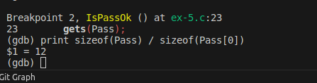
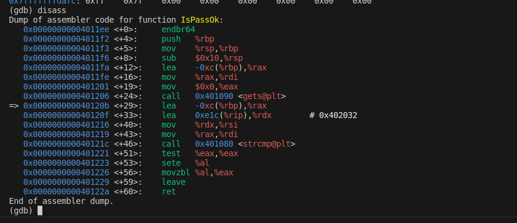
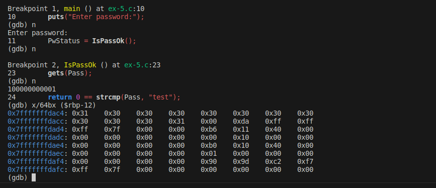
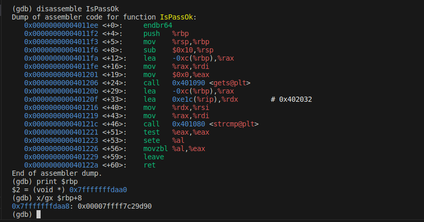
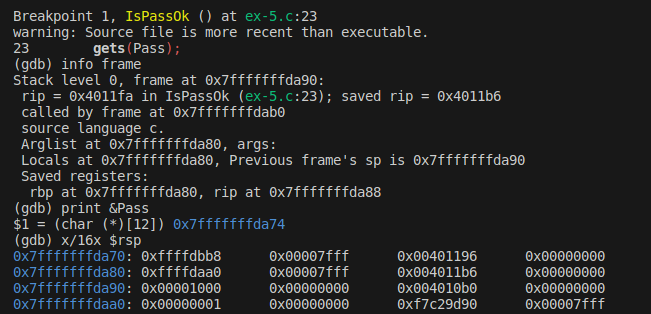
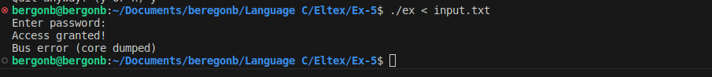

## Задание 5 Функции (Ответ в этом же файле ниже)

1) Переписать абонентский справочник с использованием функций
2) Имеется программа (исходный код которой приводится ниже,
компилировать с ключами: -fno-stack-protector -no-pie). Вам необходимо
произвести анализ программы с помощью отладчика для выяснения длины
массива для ввода пароля и адреса ветки условия проверки корректности
ввода пароля, которая выполняется при условии совпадения паролей.
Ввести пароль (строку символов)таким образом, чтобы перезаписать адрес
возврата на выясненный адрес (есть символы которые нельзя ввести с
клавиатуры, поэтому можно использовать перенаправление ввода(<) при
запуске программы).

```
#include <stdio.h>
#include <string.h>
#include <stdlib.h>

int IsPassOk(void);

int main(void){
    int PwStatus;
    puts("Enter password:");
    PwStatus = IsPassOk();
    if (PwStatus == 0) {
        printf("Bad password!\n");
        exit(1);
    } else {
        printf("Access granted!\n"); // Строка для которой нужно выяснить адрес
    }
return 0;}

int IsPassOk(void){
    char Pass[12];
    gets(Pass);
    return 0 == strcmp(Pass, "test");
}
```

## Ответ
1. **Длина массива** <br><br>
2. **Адрес строки по заданию** <br><br> мы видим адрес нашей строки в (0x00000000004011fa) выделили память. Далее мы заполнили ее `100000000001` и видим результат <br><br>
3. **Адрес возврата** `0x00000000004011d8`<br>
<br>
4. **Далее мы знаем, что у нас идет:**
- Адрес возврата: 8 байт который надо переписать на нужный нам
- `rbp`: 8 байт
- 12 байт наш массив

Для того чтобы переполнить, мы должны заполнить 28 байт. Формируем строку:
```plaintext
'c', 'c', 'c', 'c', 'c', 'c', 'c', 'c', 'c', 'c', 'c', 'c', - 12 байт
'r', 'r', 'r', 'r', 'r', 'r', 'r', 'r', - 8 байт
0xd8, 0x11, 0x40, 0x00 - адрес printf
```
5. **Формируем строку** в файле file.c <br><br>
6. **Помещаем ее в наше програму**  <br><br>