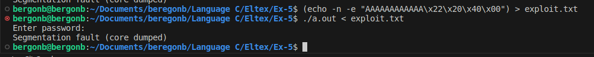

1. Адрес возврата

2. Адрес строки "Access granted!" 0x402022

3. Адрес строки "Access granted!" это 0x402022. В формате little-endian это будет \x22\x20\x40\x00.
4. (echo -n -e "AAAAAAAAAAAA\x22\x20\x40\x00") > exploit.txt
5. 