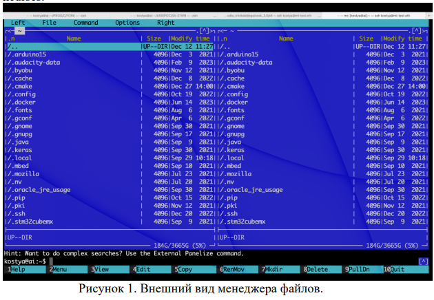

## Задание 9 Виртуальная файловая система

1) Написать программу, которая создает файл с именем output.txt,
записывает в него строку “String from file”, затем считывает ее из файла
с конца и выводит на экран
2) Реализовать файловый менеджер на подобии mc (рисунок 1), с
функционалом навигации по папкам и двумя панелями (переключение
между панелями через Tab). Использовать для графики библиотеку
ncurses.   